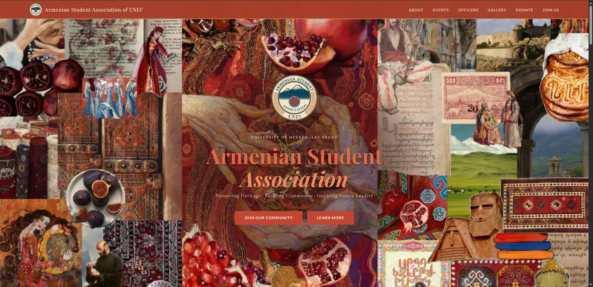

# Armenian Student Association of UNLV

The official website for the Armenian Student Association (ASA) at the University of Nevada, Las Vegas (UNLV). ASA is a cultural organization founded in 1996 that celebrates Armenian heritage, builds community on campus, and educates the broader UNLV family about Armenian history and culture.

**Live at [asaofunlv.com](https://asaofunlv.com)**



---

## About the Project

I designed and built this site as a thank you to ASA for connecting me more with my roots and I wanted to help do the same for others. This project was made to give the organization a permanent home online to help replace a scattered presence across social media with a single place where students can learn who we are, see what's coming up, and get in touch.

The design draws directly from Armenian tradition: the color palette was pulled from the Armenian flag as well as other cultural artifacts like our carpets and fruits (terracotta, navy, parchment, cream). You'll also see repeating knotwork ornamentation rendered as inline SVG, and bilingual typography that uses Armenian script alongside English.

## Features

- **Single-page architecture** with smooth-scroll navigation across Hero, About, Events, Officers, Gallery, Donate, and Join sections
- **Photo gallery** with event photos sorted into albums by semester, pulled from Supabase Storage and served through Next.js image optimization
- **Events showcase** covering recurring programming: general meetings, hikes, and other upcoming events with location and time details
- **Officer directory** with a year toggle so you can switch between the current executive board and past ones
- **Donation flow** built on Venmo deep links with preset amounts, plus a scannable QR code for anyone donating from a second device
- **Membership form** collecting name, email, interest, and a message and routing them to ASA's official inbox, alongside direct links to Instagram and the UNLV Involvement Center
- **Responsive layout** built mobile-first, with a collapsing navigation menu
- **Custom design system** defined through CSS variables for consistent theming across the site

## Tech Stack

| Layer | Technology |
|---|---|
| Framework | Next.js 16.2.9 (App Router) |
| UI | React 19.2.4 |
| Language | TypeScript 5 |
| Styling | Tailwind CSS v4 |
| Media | Supabase Storage with `next/image` optimization |
| Hosting | Vercel |
| DNS | GoDaddy, with a custom apex domain and `www` redirect |

## Design System

```
Terracotta   #C24535    Accent, borders, emphasis
Navy         #0F5066    Navigation, body text
Parchment    #D49C67    Gold detail, dividers
Cream        #F1E5CF    Primary background
Rust         #996A39    Muted text
```

Typography pairs **Playfair Display** and **Cormorant Garamond** for display and serif text with **Lato** for body copy.

## Running Locally

```bash
git clone https://github.com/tonytyper/ASA-Website.git
cd ASA-Website
npm install
npm run dev
```

Open [http://localhost:3000](http://localhost:3000).

### Scripts

| Command | Purpose |
|---|---|
| `npm run dev` | Start the development server |
| `npm run build` | Create a production build |
| `npm run start` | Serve the production build |
| `npm run lint` | Run ESLint |
| `npm run gallery:ingest` | Process and upload gallery photos to Supabase |

## Deployment

Deployed on Vercel with continuous deployment from `main`. Every push triggers a build and preview deployments are generated automatically for other branches. The production domain resolves through an A record on the apex and a CNAME on `www`, with TLS provisioned automatically.

## Contact

Instagram — [@asaofunlv](https://instagram.com/asaofunlv)
University of Nevada, Las Vegas